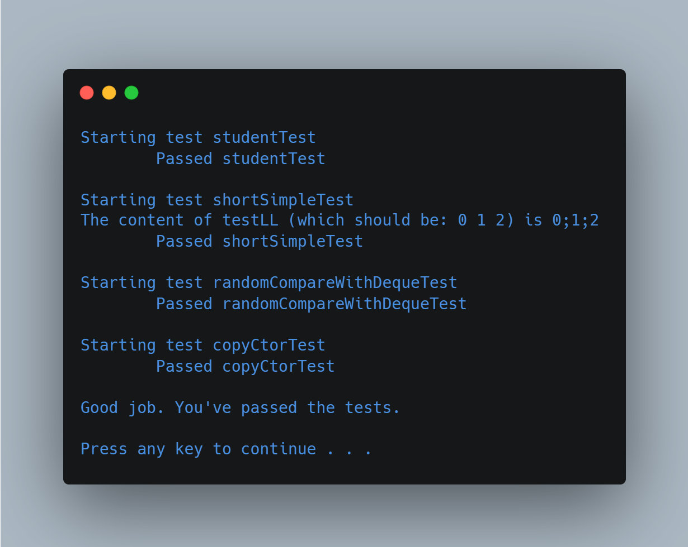

# Linked List Implementation

Data Structures

(FSC-BCS-370-Mod7/8)

## Output

## Assignment Context

This project was assigned as an exercise to fundamentally understand how a Linked List functions.

The repository contains files provided by the professor, including incomplete code for the list methods, and test code to check for the proper functionality of said methods.

The goal of the assignment was to complete the code, create a template version, and pass the tests to prove comprehension of the data structure.

This project was written in C++ using Visual Studio 2019.

## Features

This is a C++ implementation of a Linked List data structure.

The lists header file is split into two parts, one for a non-templated implementation of the list, and one for a templated implementation.
The header file also includes a definition for the statusCode enum, which is used to indicate the success or failure of various queue operations, and some constants used by the implementation.

### Methods 
- **isEmpty:** returns true if the linked list is empty
- **getHead:** retrieves the value of the head node
• **getTail:** retrieves the value of the tail node
• **insertAtHead:** inserts a node at the head of the linked list
• **insertAtTail:** inserts a node at the tail of the linked list
• **insertAfter:** inserts a node after a given node
• **findAtPosition:** finds a node at a given position in the linked list
• **remove:** removes a given node from the linked list
• **removeAtHead:** removes the head node from the linked list
• **removeAtTail:** removes the tail node from the linked list
• **various operator==() and operator!=() methods and functions**
• **rule of threes:** destructor, copy constructor, copy assignment operator
• **default constructor** default constructor for the linked list

## Tests

The test code contains three test functions: `shortSimpleTest()`, `randomCompareWithDequeTest()`, and `copyCtorTest()`. 

All of them test different aspects of the list implementation.

### shortSimpleTest()

A simple test function that creates a `Deque` object, inserts a few elements into it, and then checks whether the elements were inserted in the correct order using the `Deque::front()` and `Deque::back()` member functions. 

### randomCompareWithDequeTest()

A more involved test function that checks whether a `Deque` object behaves the same way as a `std::deque` object when performing a sequence of random operations.
It creates two empty `std::deque` objects (`std_dq` and `my_dq`) and fills them with the same sequence of random numbers using a `std::mt19937` random number generator.
It then performs a sequence of random operations on both `std_dq` and `my_dq` using a `std::uniform_int_distribution` to randomly select the operation to perform.
After each operation, it checks whether `std_dq` and `my_dq` are equal using the `std::equal()` algorithm. 
If they are not equal, it prints an error message and exits the test function.

### copyCtorTest()

A test function that checks whether the copy constructor of the `Deque` class works correctly. 
It creates a `Deque` object (`d`) and inserts a few elements into it.
It creates a new `Deque` object (`d2`) using the copy constructor, passing in `d` as the argument.
It then checks whether `d` and `d2` are equal using the `std::equal()` algorithm. 
If they are not equal, it prints an error message and exits the test function.
